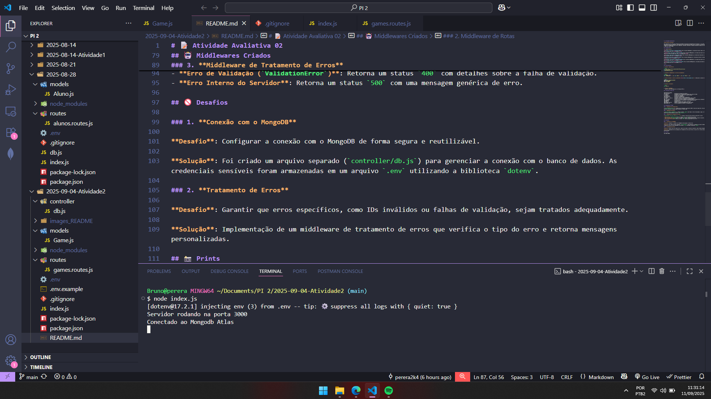
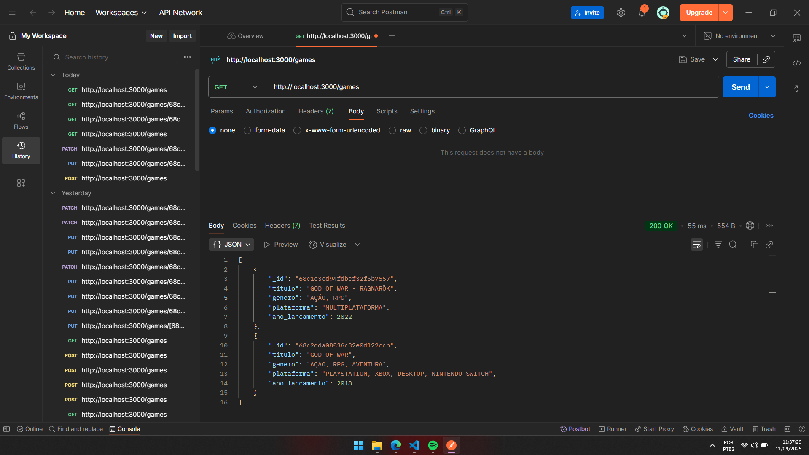
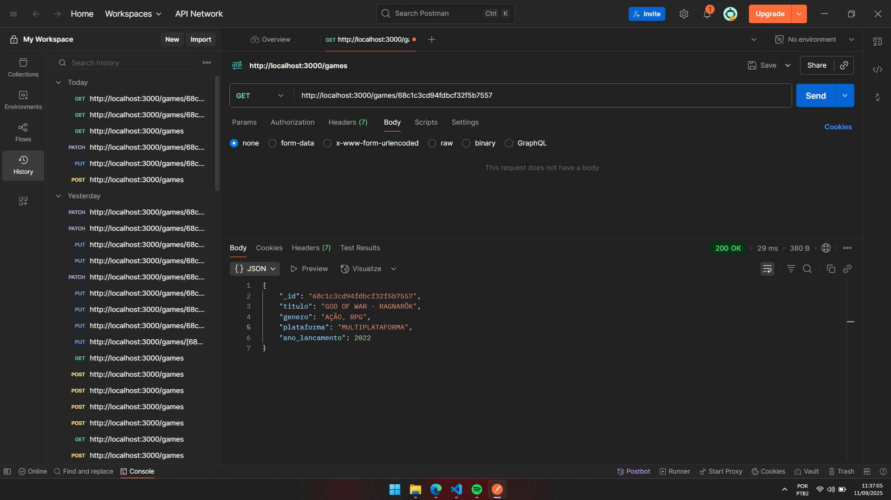
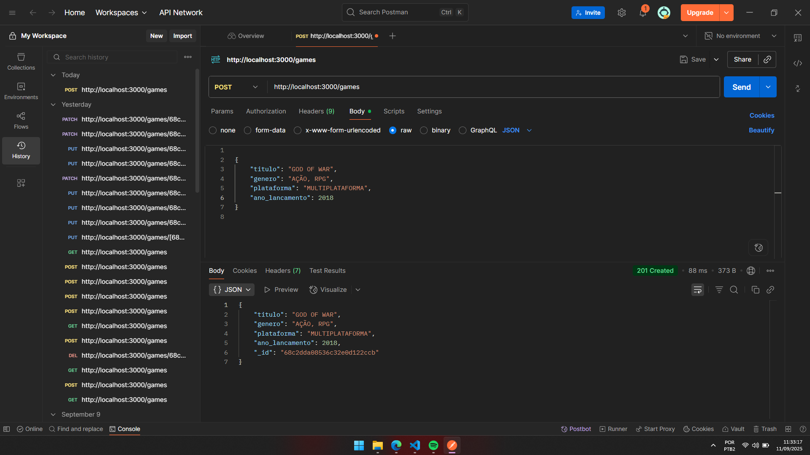
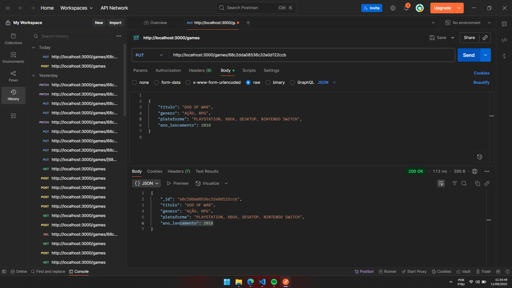
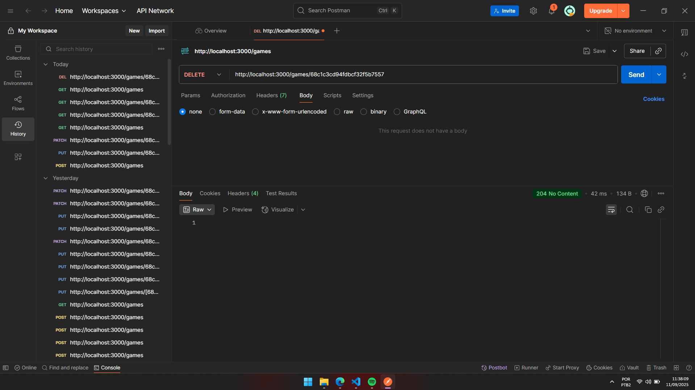
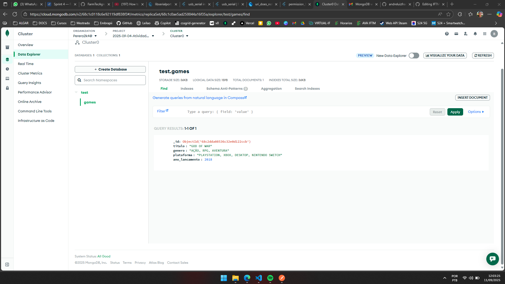

# 📝 Atividade Avaliativa 02

**Bruno Pereira Carvalho**

Este repósitorio foi feito para entrega de [atividade da disciplina de Programação para Internet 2](https://github.com/andreluizfrancabatista/aula_04_pi2_2025), nas turmas de 8ºs e 6ºs períodos de Ciência da Computação, com objetivo de criar uma aplicação node.js que irá executar um servidor backend com integração ao mongodb para que usuários cadastrem, consultem, atualizem e removam informações de jogos, de forma organizada e segura por meio do CRUD.

## 🔗 Métodos HTTP

<div align="justify">
    
 http://localhost:3000/games, utilizado para buscar todos os elementos do banco de dados pela rota <strong>/games</strong>

 http://localhost:3000/games/id, utilizado para buscar um elemento específico do banco de dados pela rota <strong>/games/id</strong>

 http://localhost:3000/games/id, utilizado para adicionar um elemento ao banco de dados pela rota <strong>/games</strong>

 http://localhost:3000/games/id, utilizado para editar um elemento do banco de dados pela rota <strong>/games</strong>

 http://localhost:3000/games/id, utilizado para editar um elemento do banco de dados pela rota <strong>/games</strong>

 http://localhost:3000/games/id, utilizado para deletar um elemento do banco de dados pela rota <strong>/games</strong>

</div>

## 🤔 Como executar?

1. **Clone o repositório**:

```bash
git clone https://github.com/perera2k4/IFTM_aulas_PI2.git
cd IFTM_aulas_PI2
cd 2025-09-04-Atividade2
```

2. **Instale as dependências e variáveis de ambiente**:

```bash
npm install --save
echo "MONGODB_URI=" >> .env; echo "USER=" >> .env; echo "PASS=" >> .env
```

3. **Crie um projeto e cluster na plataforma [Atlas](https://cloud.mongodb.com/)**: <u>Adicione os acessos</u>

```bash
MONGODB_URI="SEU_URI_DE_ACESSO"
USER="SEU_USUÁRIO"
PASS="SUA_SENHA"
```

4. **Inicie o servidor**:

```bash
node index.js
```

5. **Acesse o POSTMAN**:
   Teste as rotas mencionadas em <u>🔗 Métodos HTTP</u>

## 💾 Estrutura e descrição

```
2025-09-04-Atividade2/
├── controllers/            # Diretório de arquivos de controle
│   └── db.js               # Componente de configuração para conexão com o banco de dados
├── models/                 # Diretório com o(s) modelo(s) do banco de dados
│   └── Game.js             # Schema para o MongoDB
├── node_modules/           # Diretório de dependências
├── routes/                 # Diretório com a(s) rota(s) da aplicação
│   └── games.routes.js     # Componete responsável pela construção de regras do CRUD
├── .env                    # Arquivo de variáveis do ambiente de desenvolvimento
├── .env.example            # Arquivo de variáveis do ambiente de desenvolvimento sem exposição da credencial real
├── .gitignore              # Lista de arquivos e diretórios a serem ignorados pelo Git
├── README.md               # Documentação
├── index.js                # Arquivo principal para iniciar a aplicação
├── package-lock.json       # Mantém o controle das dependências e suas versões
└── package.json            # Contém metadados do projeto e as dependências
```

## 🤖 Middlewares Criados

### 1. **Middleware de Configuração**

**`app.use(express.json())`**: é responsável por habilitar o parsing de JSON no corpo das requisições. Ele permite que a aplicação interprete e manipule dados enviados no formato JSON.

### 2. **Middleware de Rotas**

**`app.use("/games", gamesRouter)`**: define o prefixo `/games` para todas as rotas relacionadas a jogos. As rotas específicas são gerenciadas no arquivo `games.routes.js`.

### 3. **Middleware de Tratamento de Erros**

**`app.use((err, req, res, next) => { ... })`**: captura e trata erros que ocorrem na aplicação e inclui:

- **Erro de Cast (`CastError`)**: Retorna um status `400` com a mensagem "ID inválido".
- **Erro de Validação (`ValidationError`)**: Retorna um status `400` com detalhes sobre a falha de validação.
- **Erro Interno do Servidor**: Retorna um status `500` com uma mensagem genérica de erro.

## 🚫 Desafios

### 1. **Conexão com o MongoDB**

**Desafio**: Configurar a conexão com o MongoDB de forma segura e reutilizável.

**Solução**: Foi criado um arquivo separado (`controller/db.js`) para gerenciar a conexão com o banco de dados. As credenciais sensíveis foram armazenadas em um arquivo `.env` utilizando a biblioteca `dotenv`.

### 2. **Tratamento de Erros**

**Desafio**: Garantir que erros específicos, como IDs inválidos ou falhas de validação, sejam tratados adequadamente.

**Solução**: Implementação de um middleware de tratamento de erros que verifica o tipo do erro e retorna mensagens personalizadas.

## 📸 Prints

1. **Inicialização do servidor**:
<div align="center">
   
</div>

2. **Método **:
<div align="center">
   
</div>

3. **Método  by id**:
<div align="center">
   
</div>

4. **Método **:
<div align="center">
   
</div>

5. **Método **:
<div align="center">
   
</div>

6. **Método **:
<div align="center">
   
</div>

7. **Método **:
<div align="center">
   
</div>

8. **Dados no **:
<div align="center">
   
</div>